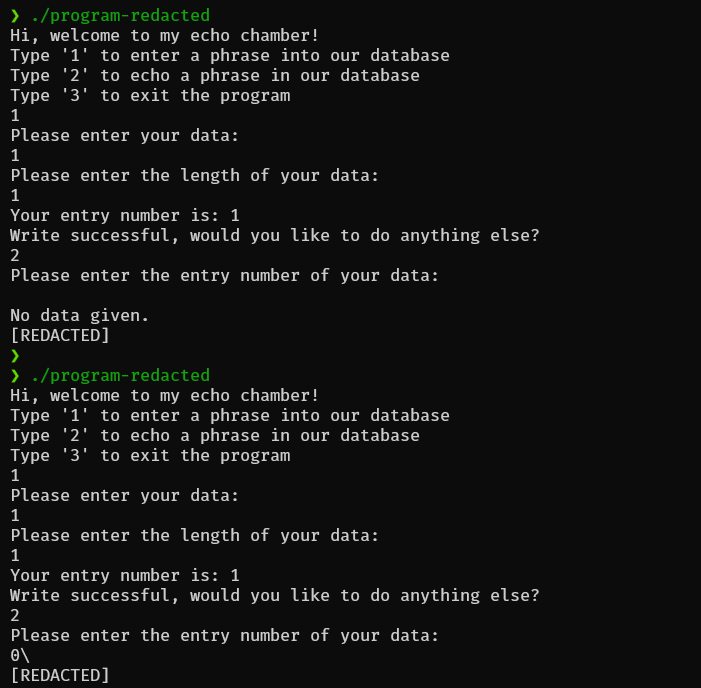
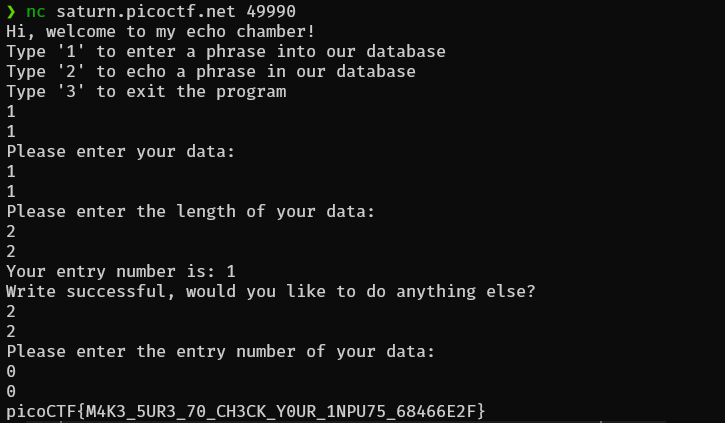

# Basic File Exploit
Cuma yapping aja

Disini vuln-nya ada di :
` if ((entry_number = strtol(entry, NULL, 10)) == 0) {
    puts(flag);
    fseek(stdin, 0, SEEK_END);
    exit(0);
}`
yang mana jika nilai dari entry number itu 0 maka akan puts/mengambil flag nya.
disini kita harus memasukkan data dummy untuk menu no 1,kemudian di lanjut jika write successfully lanjut untuk ke menu no 2.Nah,di menu 2 ini jika kita sudah memasukkann data dummy di menu 1 kita akan diminta memasukkan data entry pada menu kedua ini,disinilah vuln nya,jika kita mengosongi/input angka 0 data entry nya maka entry number akan bernilai 0 (entry_number == 0) dan program akan menampilkan flag.

`flag : picoCTF{M4K3_5UR3_70_CH3CK_Y0UR_1NPU75_68466E2F}`
